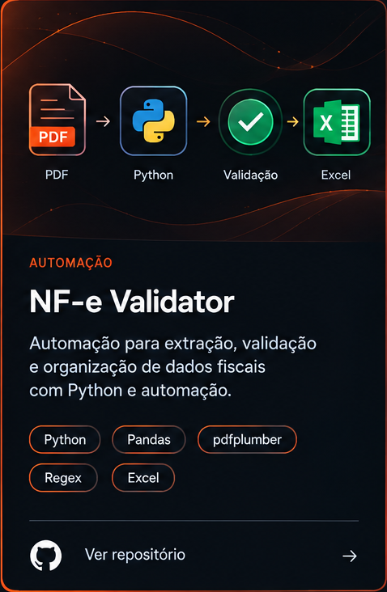
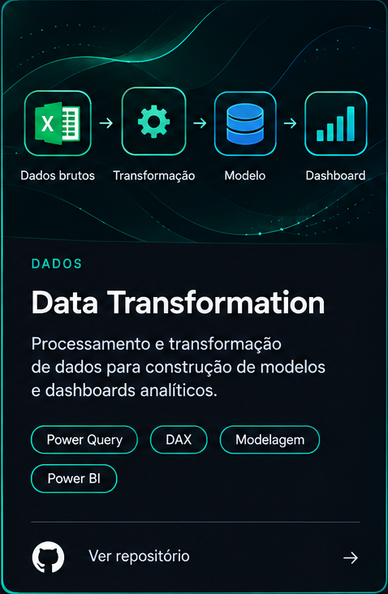
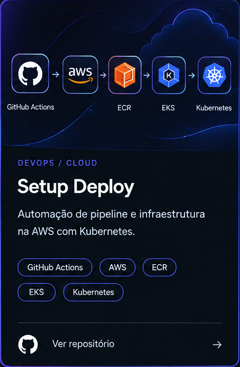

&nbsp;

# SUÉLEN LIMA

### Data Analytics · Automation · Engineering

📊 Data · 🔄 Automation · 📈 Analytics · ⚙️ Engineering

 

Atuo com **dados, análise e processos**, conectando tecnologia e contexto de negócio para construir soluções mais eficientes.

Minha experiência envolve **preparação, tratamento, validação e análise de dados**, além de automação de processos.

Atualmente, estou direcionando minha evolução profissional para **Data Engineering**, aprofundando conhecimentos em **Python, SQL, ETL/ELT, modelagem de dados, pipelines e automação**, sem deixar de lado minha experiência em Data Analytics.

Gosto de transformar processos manuais ou complexos em soluções mais **estruturadas, confiáveis e reproduzíveis**.

 

## Projetos

<table>
<tr>

<td width="33%" align="center">

</td>

<td width="33%" align="center">

</td>

<td width="33%" align="center">

</td>

</tr>
</table>

 
 

### 📊 Dados que fazem sentido. ⚙️ Processos que funcionam. 🚀 Soluções que evoluem.

 

Python · SQL · Power BI · Power Query · DAX · ETL · Data Modeling
AWS · Docker · Kubernetes · Terraform

 
 

Construindo conhecimento, projetos e soluções orientadas a dados. 🚀

