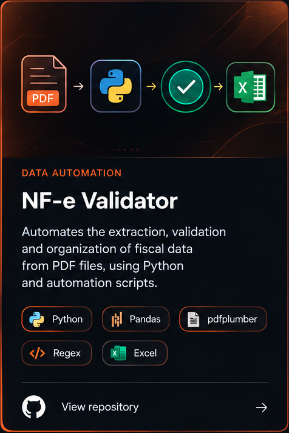
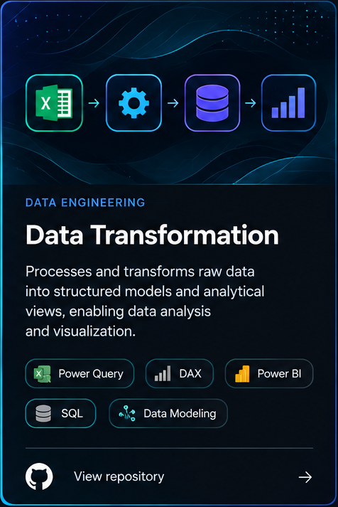
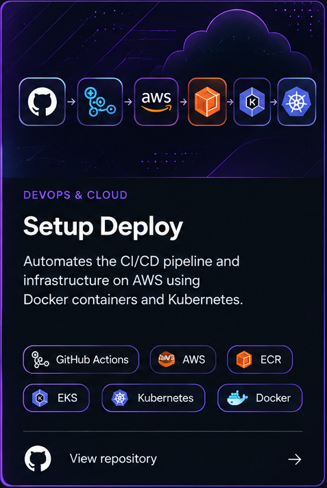

&nbsp;

# SUÉLEN LIMA

📊 Data · 🔄 Automation · 📈 Analytics · ⚙️ Engineering

 

I work with **data, analytics, and processes**, connecting technology and business context to build more efficient solutions.

My experience includes **data preparation, transformation, validation, and analysis**, as well as process automation.

I am currently directing my professional development toward **Data Engineering**, deepening my knowledge of **Python, SQL, ETL/ELT, data modeling, pipelines, and automation**, while continuing to build on my experience in Data Analytics.

I enjoy transforming manual or complex processes into solutions that are more **structured, reliable, and reproducible**.

 

## Projects

<table>
<tr>

<td width="33%" align="center">

</td>

<td width="33%" align="center">

</td>

<td width="33%" align="center">

</td>

</tr>
</table>

 
 
 

### 📊 Data that makes sense. ⚙️ Processes that work. 🚀 Solutions that evolve.

 

Python · SQL · Power BI · Power Query · DAX · ETL · Data Modeling  
AWS · Docker · Kubernetes · Terraform

 
 

Building knowledge, projects, and data-driven solutions. 🚀

